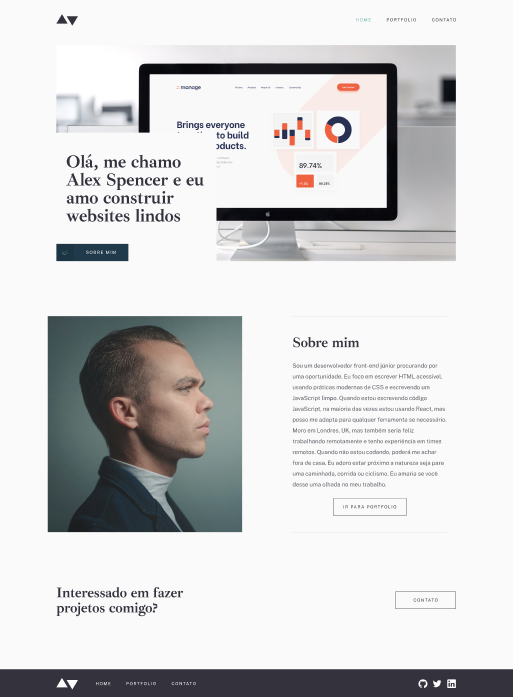

# Desafio Módulo 1 - Portfólio

A proposta da atividade foi a elaboração de um portfólio utilizando HTML e CSS. Conceitos aplicados:

* Elementos semânticos de bloco
* Links no HTML
* Box-model
* Reset de margins e paddings
* Modificação de fontes
  * Importação de fontes do Google Fonts
  * Modificação de peso e tamanho
* Manipulação de imagens
  * Imagens de fundo
  * Modificação de tamanho e posicionamento
* Layout flex
  * Eixos do flexbox
  * Alinhamento do flexbox
* Elementos de formulários
* Pseudo classes `focus` e `hover`
* Utilização do Figma